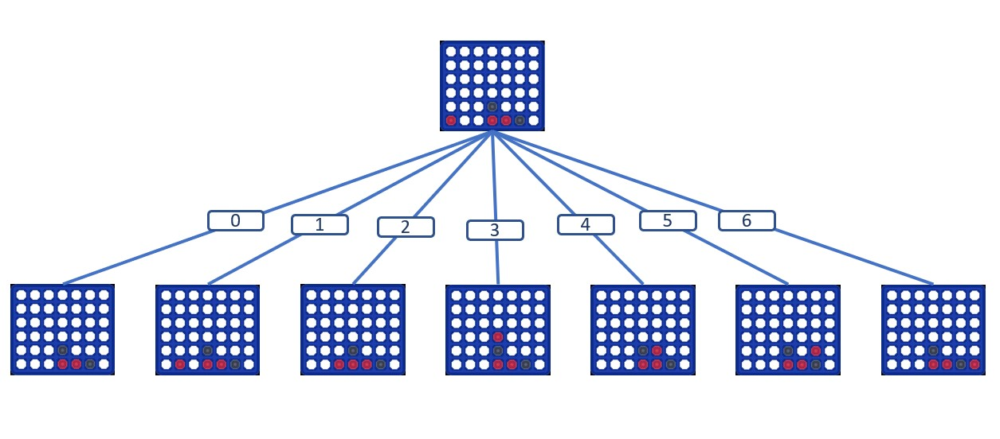
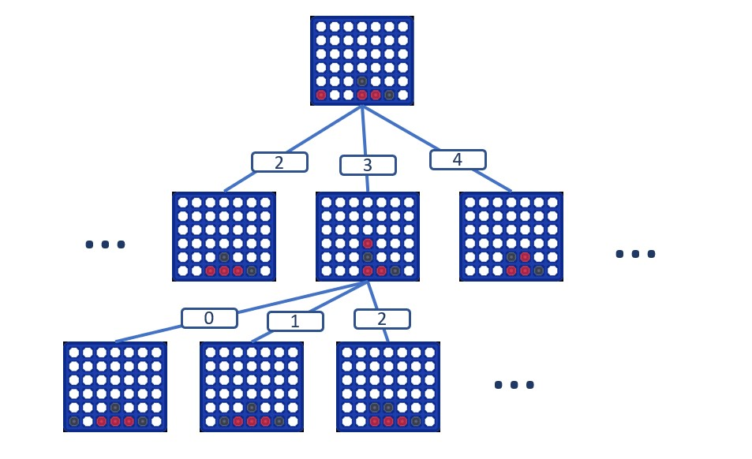
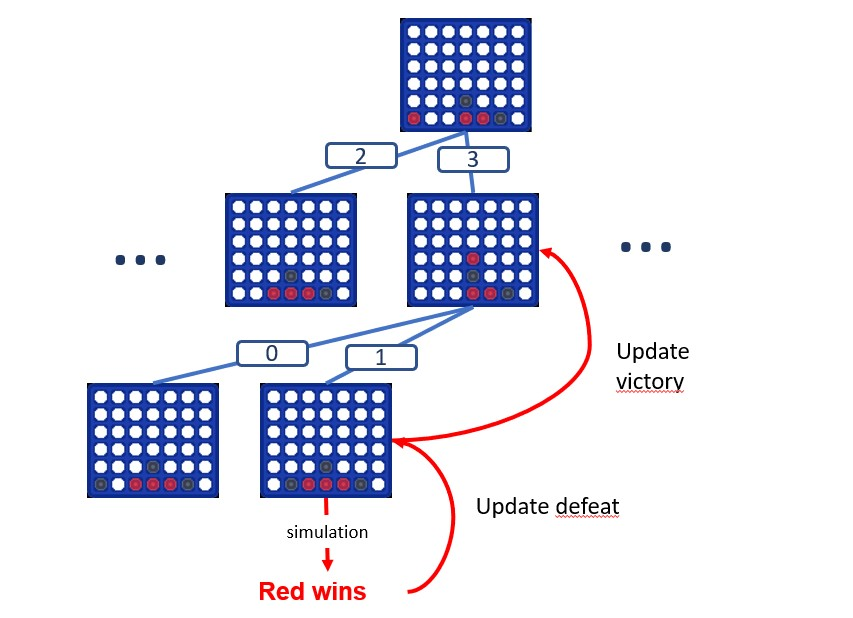
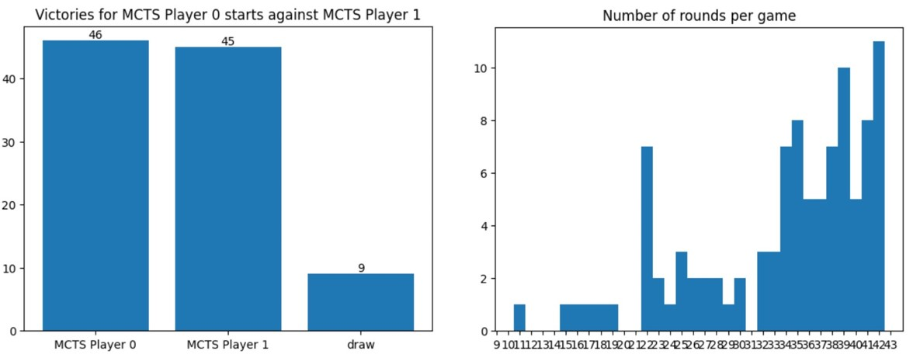

# MCTS Connect4 AI

Implemented by _Paul Louzier_

Short report about the MCTS algorithm implemented to play Connect4.

## 1 - Principle

The Monte Carlo Tree Search is based on a tree with nodes representing the game board at different states.

The root is the current game state and its children nodes are the state planned if the agent takes one action or another.
Each node has a score and the algorithm must choose the one with the highest score. In order to compute them, the algorithm will simulate several random games from each child and count its winning rate for each of its children.
Computing these scores is done in four steps:

### Selection

The algorithm starts by selecting a node from which it will start its random games. It will follow the following formula (UCT formula) to choose it:

$$
best\_node = \argmax\limits_{i \in children} \frac{w_i}{n_i} + \delta * \frac{\sqrt{\ln{N}}}{n_i}
$$

where:

- $\delta$ is the exploration paramter. I set it to $\sqrt{2}$ since it is a usual value for it.
- $n_i$ is the number of previous simulations taking $i$ into account
- $N$ is the number of previous simulations taking the root node into account

This equation represents the usual balance between exploration ($\frac{\sqrt{\ln{N}}}{n_i}$) and exploitation ($\frac{w_i}{n_i}$).

Usually, $w_i = v_i - l_i$ where $v_i$ is the number of simulations won by the agent taking $i$ into account and $l_i$ the number of lost ones. But I brought some modifications since the agent's behavior did not satisfy me (see the [Modifications](#2---modifications-to-the-original-behavior) section).

This way, the algorithm selects the best node successively until it reaches a leaf.

### Expansion

Once we reached a tree's leaf, we expand the tree by creating all the leaf's possible children and then we choose arbitrarly one of the newly created nodes

### Simulation

Once we chose a leaf from which starting our simuation, we simulate a game and observe the result. The game is simulated totally randomly (at each round the players choose their play randomly among the possible options).

### Backpropagation

Once we simulated a game, we observe the result and we make it backpropagate until the root node.

We notice that the updated category "victory" or "defeat" is not the same from one layer to another. Indeed the weights are used to simulate a game. Hence when the red player (the agent) wins a simulated game, the layers indicating the possible red player plays must update their "victory" counters but the other layers must update their "defeat" counters since the black player will be less prone to take this path.

### Finally: choosing a play

We repeat the four previous steps a hudge amount of times and then we choose the best move to play using only the exploitation part of the UCT formula.

The more we repeat the four steps, the more efficient our algorithm will be since it explores more nodes of the tree of the possible games and can anticipate better the opponent plays. I noticed that 10000 rollout rounds were a good value by playing several games with the algorithm.

## 2 - Modifications to the original behavior

I chose to change the UTC formula since the agent presented undesirable behavior in several games. Indeed sometimes, because of the randomization of the simulated games, notably because of simulation ending by "drawn" which increase a lot $n_i$ without changing $w_i$, the formula could designate a state which was clearly a loosing one (allowing me to align easily four pawns while there were other alternatives) as the best move. I noticed it often happened at the end of a game when the number of simulation is quite high for each node and victory or defeat come really fast. So I changed the $w_i$ formula with this one:

$$
w_i = \frac{\sum\limits_{s \in S_i} score(s)}{\left| S_i \right|}
$$

where $S_i$ is the set of simulations passing through $i$ node (we notice that $n_i = \left| S_i \right|$) and $score(s)$ is computed as follow:

$$
score(s) = \left( \left( d_s = 1 \right) * 1000 + \left( d_s > 1 \right) * \frac{1}{d_s} \right) * \left(v_s - l_s - e_s \right)
$$

where

- $v_s = 1$ if the agent won the simulation
- $l_s = 1$ if the agent lost the simulation
- $e_s = 1$ it the simulation was a "drawn" game
- $d_s$ is the number of rounds separating the node and the simulation result (for example if the simulation took 6 rounds from the node to end then $d_s = 6$)

This have three objectives:

- Take the "drawn" games into account and not allow them to increase a lot the $n_i$ factor without rebalance it in the $c_i$ factor.
- Consider a far reached ending less impacting than a short sighted one. For example if the agent is going to make a move that will make it win in 3 rounds but leaves the field open for its opponent to win in 2 rounds, the fact that it looses must be more important than the fact that it wins.
- The term $\left( d_s = 1 \right) * 1000$ is a kind of failsafe. If the agent is going to loose or win in the next round it really must be aware of it at any cost so we demultiplicate the weight of the result to insist on it.

## 3 - Results

The resulting algorithm gives satisfying results. It wins 99% of its games against a random player (the remaining games were "drawn") and was able to almost draw a game against me.

When the MCTS plays against itself, it wins almost 50% of the time, which means that playing first has few importance for him and the games are usually quite long which means he defends himself quite well.

The following results were obtained with 2000 of rollouts per round:

A little downside that we can notice is that it really plays a defensive game but since defeats and drawns are considered as defeats in its tree, it does not often put the opponent in difficulty (even if I saw it doing quite offensive moves, it often make quite simple attempts to win) and so it has strong probabilities to loose the long game. It is sometimes able to anticipate subtle attempts supposed to make it lose in a few rounds.

## 4 - Going furter

This approach remains really simple and expansive to compute. It would not be appropriate for really complex games like chess were the number of children is realy too high (even a simple state with only a queen in the center of the board has 27 possible moves). The current algorithm takes 30 seconds to compute its first move and it only has the choice between 7 moves and it is not even able to beat me.

I already thought about improvements for this basic MCTS:

- Store the tree weights in a json file and reuse them from a game to another. It would be considered as some kind of training which could be exploited in later games.
- Use a heuristic during the [Simulation](#simulation) phase to play smarter games than random ones. Moreover it could allow to upscale the algorithm and adapt it for more complex games.
- Break the tree structure could allow to reuse some previous computations and save time and space. Indeed a Connect4 space can be reached through several different spaces so the tree structure is not adapted to represent the space of the possible states. It could also allow to use heuristics such as the shortest path in the [Simulation](#simulation) phase.
